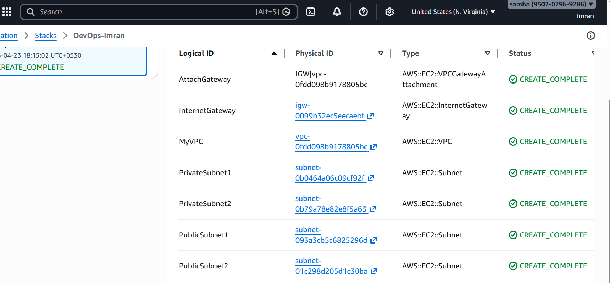

### What is Infrastructure as Code (IaC)?

Infrastructure as Code (IaC) means managing and provisioning infrastructure using code instead of manual steps.

Instead of clicking in a cloud console:

You write configuration files
Run a command
Infrastructure gets created automatically

Example

Instead of manually creating:

VPC
Subnets
EC2
Security Groups

You define all of this in a file → run → everything is created.

#### Popular IaC Tools
Terraform (multi-cloud)

AWS CloudFormation (AWS only)

Azure Resource Manager

#### Why IaC is Used
1. Automation

No manual setup → everything is automated

2. Consistency

Same code = same infrastructure every time

3. Version Control

You can store infra code in Git (like application code)

4. Faster Deployment

Spin up full environments in minutes

5. Disaster Recovery

Recreate infrastructure instantly

### What is AWS CloudFormation?

AWS CloudFormation is an AWS-native IaC service used to create and manage AWS resources using templates.

### How CloudFormation Works

You write a template file (YAML or JSON) like this:

Resources:
  MyEC2:
    Type: AWS::EC2::Instance
    Properties:
      InstanceType: t2.micro
      ImageId: ami-12345678

Then run a command → AWS creates everything.

### Key Concepts in CloudFormation
1. Template

The code file (YAML/JSON)

2. Stack

A collection of AWS resources created from a template

3. Resources

Actual AWS services (EC2, S3, VPC, etc.)

### Why CloudFormation is Used
✔ Native AWS Integration

Works tightly with all AWS services

✔ No Need for External Tools

Unlike Terraform, no extra installation needed

✔ Dependency Handling

Automatically creates resources in correct order

✔ Rollback Support

If something fails → automatically rollback

### Where CloudFormation is Used

Creating full AWS environments

Automating VPC setup (like what you did manually via CLI)

Deploying infrastructure in CI/CD pipelines

Managing production infrastructure safely

### Below is a complete CloudFormation YAML template that matches what you built manually:

1 VPC

1 Internet Gateway

2 Subnets (Public + Private)

2 Route Tables

AWSTemplateFormatVersion: '2010-09-09'
Description: Fixed VPC Setup Using Dynamic AZ

## Resources:

### VPC
  MyVPC:

    Type: AWS::EC2::VPC
    Properties:
      CidrBlock: 10.0.0.0/16
      EnableDnsSupport: true
      EnableDnsHostnames: true

### Internet Gateway
  InternetGateway:

    Type: AWS::EC2::InternetGateway

  AttachGateway:
    Type: AWS::EC2::VPCGatewayAttachment
    Properties:
      VpcId: !Ref MyVPC
      InternetGatewayId: !Ref InternetGateway

### Public Subnet 1
  PublicSubnet1:

    Type: AWS::EC2::Subnet
    Properties:
      VpcId: !Ref MyVPC
      CidrBlock: 10.0.1.0/24
      AvailabilityZone: !Select [0, !GetAZs ""]
      MapPublicIpOnLaunch: true

### Public Subnet 2
  PublicSubnet2:

    Type: AWS::EC2::Subnet
    Properties:
      VpcId: !Ref MyVPC
      CidrBlock: 10.0.2.0/24
      AvailabilityZone: !Select [1, !GetAZs ""]
      MapPublicIpOnLaunch: true

### Private Subnet 1
  PrivateSubnet1:

    Type: AWS::EC2::Subnet
    Properties:
      VpcId: !Ref MyVPC
      CidrBlock: 10.0.3.0/24
      AvailabilityZone: !Select [0, !GetAZs ""]

### Private Subnet 2
  PrivateSubnet2:

    Type: AWS::EC2::Subnet
    Properties:
      VpcId: !Ref MyVPC
      CidrBlock: 10.0.4.0/24
      AvailabilityZone: !Select [1, !GetAZs ""]

